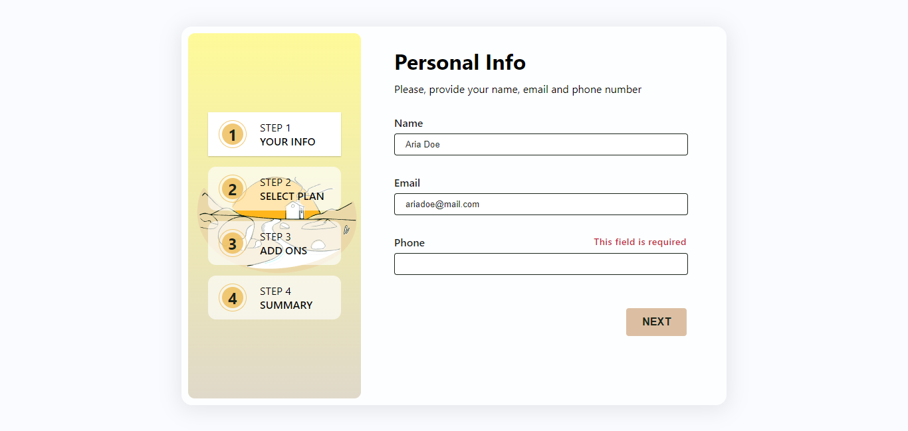
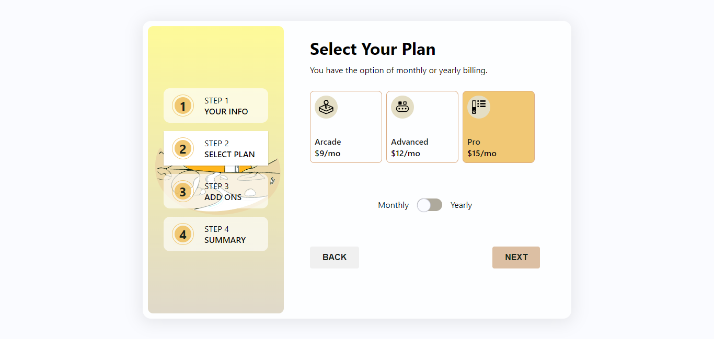
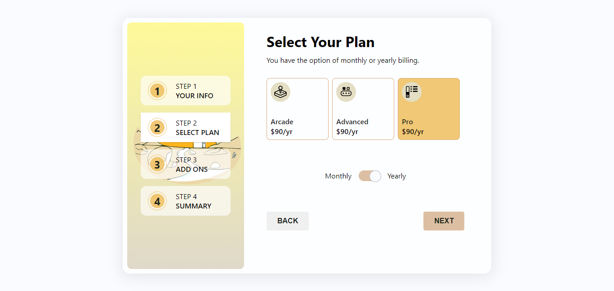
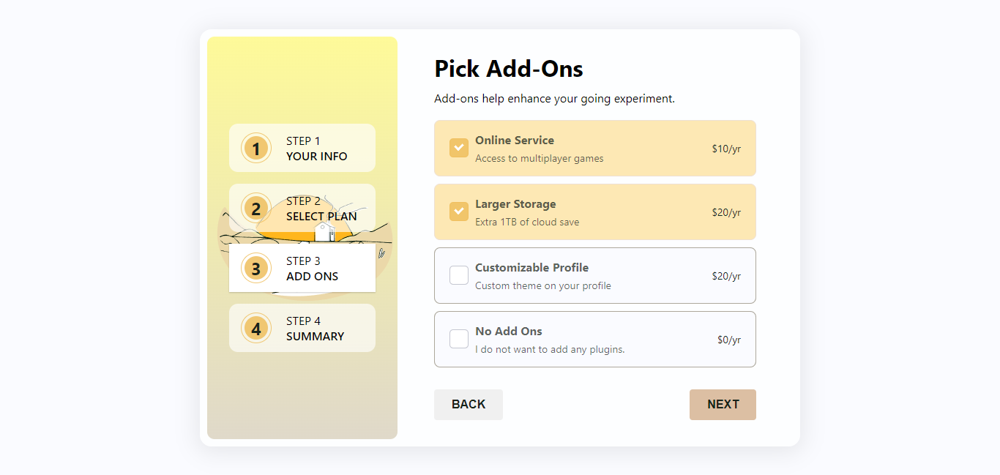
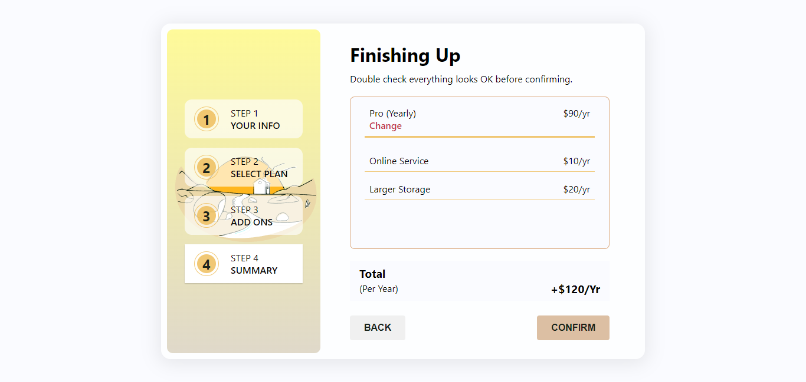
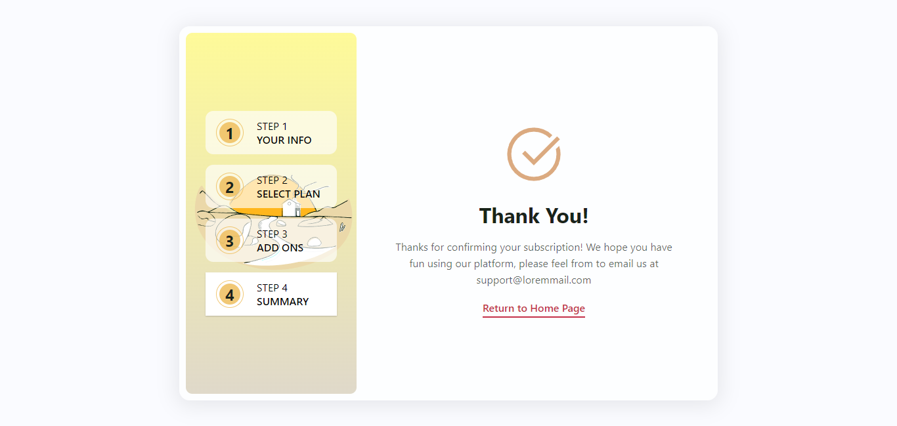

# Multiple Step Form

In this project, I created a form with multiple steps. I wrote the project with Vue3, SASS, and I used Vuex as a store. Thus, when you move back and forth while filling the form, your data is not lost. You can make changes as you wish and continue to the other stages.

## My Actions in the Project

✅ I created the entire project as a responsive design with SASS.

✅ I created and activated the warning text that appears when the next button is clicked in case of incorrect data being entered or left blank while entering personal information. (For each input field)

✅ During the plan selection phase, you can view the monthly and annual plans with the switch button I created and choose the one you want.

 

✅ When you come to the add-on selection area, the first two of the add-ons are selected. Here you can deselect all of them, and choose the last option and not purchase any add-ons, or you can choose any of the three options above (Note: If you selected the monthly plan in the previous step, the prices will be according to the monthly plan, if you selected the annual plan, the prices will be according to the annual plan.)

✅ In the summary stage, you will see the plan you have chosen, its price, and the add-ons you have chosen, their prices and the total amount. If you want to make a change, you can go back to the previous stage with the back button and change the add-ons you have chosen. Or, you can go to the select plan stage by clicking on the "Change" link and start making selections again from there and come to the final stage.

✅ When you finish your selections and click the confirm button, you will see a thank you message. If you wish, you can return to the home page with the link below.

## Tecchnologies & Libraries

> Vue3 with Vite

> Vuex

> SASS